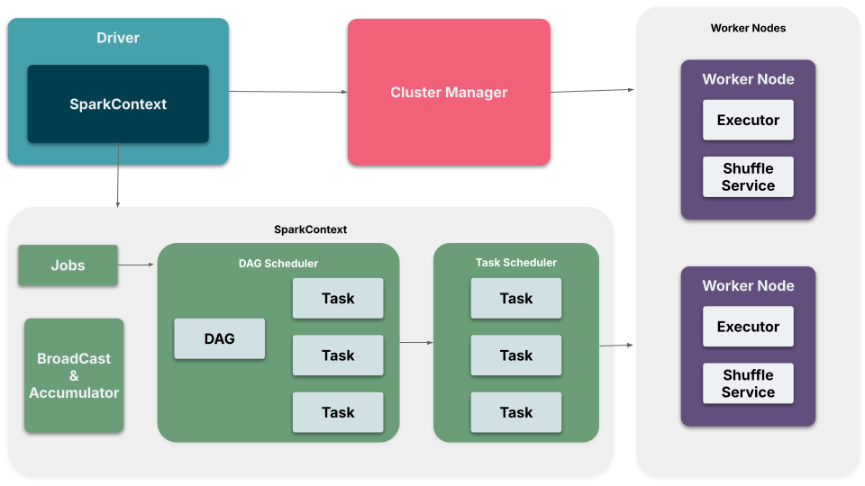
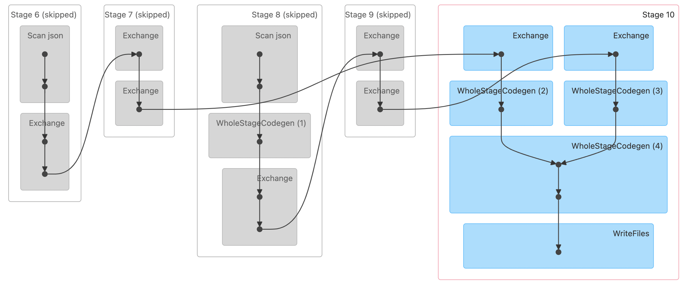
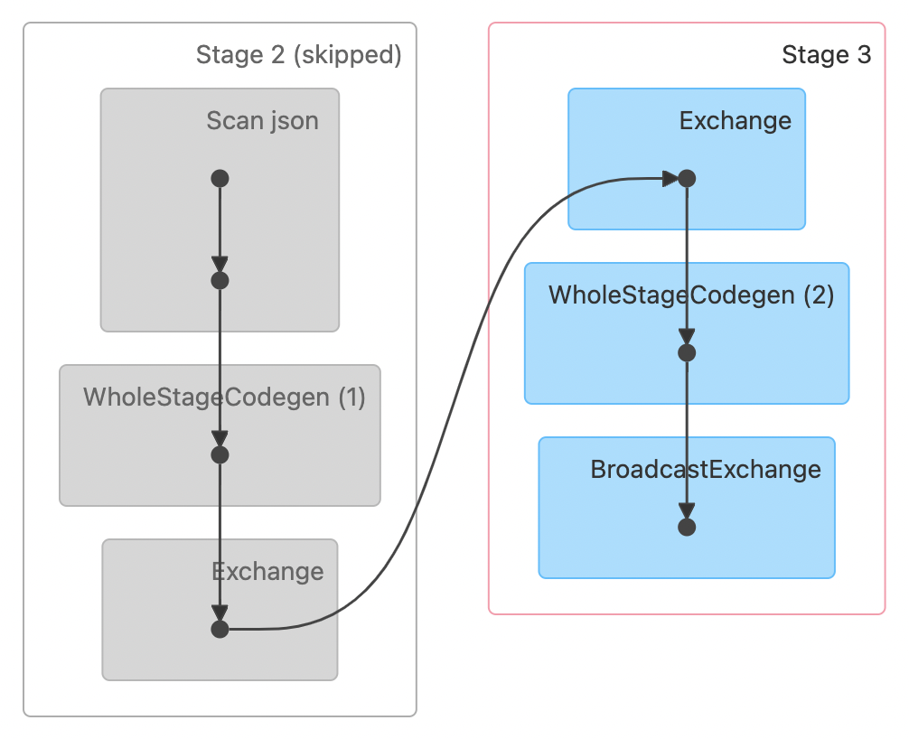

## What is Spark?

Spark is an open-source framework that is used for distributed data processing. In other words, it can be considered a successor to the Hadoop platform. Spark provides a unified interface to process large volumes of data by abstracting the complexity of distributed computing and storage.

Historically, Hadoop solved the problem of variety, volume, and velocity of data by adopting distributed mechanisms for cluster management (YARN), storage mechanism (HDFS), and compute (MapReduce). However, Hadoop-based systems are not optimized for performance and have strong coupling with YARN and Java. Spark was designed to solve some native issues encountered in the Hadoop system.

1. Spark supports in-memory processing, hence optimized for performance.
2. Spark programming supports Java, Scala, Python, and R.
3. Cluster management is available through Kubernetes, Mesos, and YARN orchestrators.
4. Spark supports advanced data workloads such as ML algorithms, graph and stream processing through MLlib, GraphX, and Stream API.
5. Spark eases the development of data applications through a unified API of Dataframe and Spark SQL through the adoption of Resilient Distributed Dataset (RDD).

Following is the high-level logical architecture of Spark.


Following are key aspects of different layers in the architecture:
1. The top layer exposes APIs for addressing different data processing requirements like machine learning, graph, stream and SQL. Using these APIs, we can build continuous and streaming data workloads.
2. The Spark Core is the foundation for the top layer through its Resilient Distributed Dataset (RDD), optimizations (catalyst optimizer), scheduling, and other abstractions.
3. The Spark engine is the heavy lifter that understands the Spark application request, generates DAG, breaks the flow into smaller units, schedules the units, supplies the required data to the units, monitors and provides fault tolerance to the smaller units, and finally orchestrates the results.
4. Cluster manager provides the abstraction of master and worker nodes of the cluster from the Spark application. Typically, this layer would be substituted by YARN, Mesos, and Kubernetes.
5. Compute and storage resources power all the layers with required processing and storage space. This layer is provisioned by cloud infrastructure providers like Azure, AWS, and GCP.

## What is Databricks

Databricks is a Spark-based managed cloud data platform that provides comprehensive solutions related to data engineering, data science, data analytics, and machine learning. Following are key features of Databricks when compared with Spark.

1. Databricks provides managed Spark environments, which simplify the configuration, setup, and management of Spark clusters.
2. It provides notebooks and workspaces for the team's collaboration, making it easy to develop and deploy data processing and analysis tasks.
3. It provides data governance through the Unity Catalog.
4. Databricks offers lakehouse capabilities through Delta Lake.
5. There are administrative controls and automations available in Databricks for managing large-scale projects.
6. Built-in security controls are available to provide role-based access controls.
7. Data ingestion and integration is made easy through Delta Live tables and Autoloader.
8. Photon acceleration is available to deliver optimized performance in SQL analytical workloads.
9. Different features available for Data science and ML flows

## Spark Architecture

In this section, we are going to learn the details of Spark architecture. Let's first understand different components of Spark architecture.

| Component                  | Primary responsibilities                                                                                                                                                                                                           |
|----------------------------|------------------------------------------------------------------------------------------------------------------------------------------------------------------------------------------------------------------------------------|
| SparkContext               | SparkContext is the entry point to all of the components of Apache Spark (execution engine). It coordinates with Cluster manager for requesting resources and launching executors. It also helps in configuring spark application. |
| Driver                     | It is a process which creates and hosts the SparkContext. Converts code into logical execution plan. Requests resources from the Cluster Manager and distributes tasks to Executors.                                               |
| Executors                  | Execute individual tasks assigned by the Driver. Store intermediate data in memory or disk. Report the status of each task back to the Driver.                                                                                     |
| Cluster Manager            | Schedules and allocates resources to various Spark applications. Launches Executor processes on worker nodes.                                                                                                                      |
| DAG Scheduler              | DAGScheduler transforms a logical execution plan to a physical execution plan (using stages), keeps track of preferred locations to execute stages. Handover the stages for to Task Scheduler.                                     |
| Task Scheduler             | Distributes tasks to the Executors. Ensures that tasks are balanced and executed in the right order.                                                                                                                               |
| Shuffle Service            | Manages the movement of data between Executors during shuffle operations. Ensures that the data required by downstream tasks is available on the correct nodes.                                                                    |
| Broadcast and Accumulators | These are shared variables in Spark used for broadcasting large read-only data to all executors efficiently. Accumulators used to perform efficient aggregation operations like counters and sums.                                 |

> NOTE: The worker nodes and storage systems provide the required compute and storage infra for cluster manager and Spark framework.



## Read and Write formats and modes

Spark supports a variety of read and write formats. Here are some of the most commonly used formats and their characteristics:


| Format  | Format         | Schema evolution | Suitable for                              | Optimized for Large <br/>and complex data? |
|---------|----------------|------------------|-------------------------------------------|--------------------------------------------|
| TEXT    | Row            | Hard             | Log processing, <br/>Simple data exchange | No                                         |
| JSON    | Nested         | Hard             | Web and APIs                              | No                                         |
| CSV     | Row            | Hard             | Simple data exchange                      | No                                         |
| PARQUET | Columnar       | Easy             | Analytical queries                        | Yes                                        |
| ORC     | Columnar       | Easy             | Analytical queries                        | Yes                                        |
| AVRO    | Row            | Easy             | Batch & Streaming Data                    | Yes                                        |
| DELTA   | Columnar       | Easy             | Batch & Streaming Data                    | Yes                                        |
| HUDI    | Row & Columnar | Easy             | Batch & Streaming Data                    | Yes                                        |

In Spark, when writing data to external storage, we can specify different write modes that determine how the data is written in relation to existing data. 

1. **Append**: Adds the new data to the existing data
2. **Overwrite**: Replaces the existing data with the new data.
3. **Ignore**: Does nothing if data already exists
4. **ErrorIfExists** (default): Throws an error if data already exists

## Spark Lazy evaluation with transformations and actions

Let's first understand Spark's transformations and actions. Transformations are operations on existing Spark DataFrame to produce new DataFrame. Examples are `select`, `selectExpr`, `filter`, `where`, `groupBy`, `agg`, `join`, and `withColumn`, etc. Actions are operations which execute all the transformations and return the result to the drive program. Example actions are `show`, `collect`, `write`, `count`.

Transformations are lazy, they don't trigger the execution, whereas actions trigger the execution. Spark creates an execution plan in the form of a DAG (Directed Acyclic Graph) based on transformations, which is then optimized to reduce data shuffle and operations. Finally, the DAG is executed when an action is encountered. This is called lazy evaluation in Spark.

## Shuffle Sort Merge Join and Broadcast Join

Spark supports two common types of joins - `Shuffle Sort Merge Join` and `Broadcast Join`.

**Shuffle Sort Merge Join**:
It is the default join strategy in Spark which is designed to handle joins between two large datasets that are distributed across the cluster. It contains `shuffle`, `sort`, `merge` operations. 

- **Shuffle**: Spark first redistributes the data across different partitions based on the join key. This shuffle ensures that all records with the same join key end up in the same partition.
- **Sort**: Once the data is shuffled, it is sorted within each partition by the join key.
- **Merge**: Finally, the sorted data is merged, meaning the join operation is performed by combining the records from both datasets that have the same key.

> NOTE: `spark.sql.shuffle.partitions` setting is used to configure the number of shuffle partitions.

The following code from [app.py](./../src/first-app-v13/app-v1.py) will trigger a shuffle sort merge join.

```
# Read the JSON file into a DataFrame with the defined schema
movies_df = get_df(spark, source_movies_file, movies_schema)
ratings_df = get_df(spark, source_ratings_file, ratings_schema)

# To simulate the shuffle by creating partitions
movies_df = movies_df.repartition(4)
ratings_df = ratings_df.repartition(4)

# Join movies_df and ratings_df on movie_id
movie_ratings_df = movies_df.join(ratings_df, movies_df.movie_id == ratings_df.movie_id, how="left_outer").drop(ratings_df.movie_id)
```

Set shuffle partitions in spark.conf.
```
spark.app.name=HelloSpark
spark.master=local[4]
spark.sql.shuffle.partitions=4
```

The DAG shows that a shuffle operation happens at Stage 10 through reduce exchanges which are reading data from previous stages map exchanges.



**Broadcast Join**:
Broadcast Join is used when one of the datasets is small enough to fit into memory of the executor. In this approach, the smaller dataset is broadcasted to all the worker nodes (which runs executors) in the cluster, eliminating the need for a shuffle operation.

> NOTE: Spark automatically selects Broadcast Join if the smaller dataset's size is below a certain threshold. `spark.sql.autoBroadcastJoinThreshold` setting is used to control the maximum size of the smaller dataset that can be broadcasted.
> NOTE: Manual broadcasting can be achieved using `broadcast()` function while performing a join operation.

The following code from [app.py](./../src/first-app-v13/app-v2.py) will trigger a broadcast join.

```
# Read the JSON file into a DataFrame with the defined schema
movies_df = get_df(spark, source_movies_file, movies_schema)
ratings_df = get_df(spark, source_ratings_file, ratings_schema)

# to ensure we broadcast only a smaller dataset
ratings_df = ratings_df.limit(100)

# to ensure we have parititons spread across 
movies_df = movies_df.repartition(4)

# Join movies_df and ratings_df on movie_id
movie_ratings_df = movies_df.join(broadcast(ratings_df), movies_df.movie_id == ratings_df.movie_id, how="left_outer").drop(ratings_df.movie_id)
```

Set shuffle partitions in spark.conf.
```
spark.app.name=HelloSpark
spark.master=local[4]
spark.sql.shuffle.partitions=4
```

The DAG shows that a broadcast exchange operation happens at Stage 3 where the smaller ratings dataframe is broadcast to the executors to perform the join.



## Spark performance and partition optimizations

Following are few techniques and configurations which we can adapt to optimize the performance of Spark application.

##### Only load the data which is absolutely required

- The costliest operation in Spark engine is shuffling the data. Loading unwanted data would make spark to make it available for shuffle operations (Map and Reduce exchanges). This can be avoided by filtering the unwanted rows and columns from the Dataframe.

##### Reduce the size of DataFrame

- Try to reduce the size of DataFrame through cleansing and aggregation activities before the join operations. The smaller the DataFrame size, the faster the shuffle operation and higher the performance.

##### Ensure Join key cardinality

- The Join key cardinality directly affects the number of parallel tasks which can be executed. Ensure good cardinality of join keys.
-  Distribution of data across keys should also be normalized. Imaging we have 1000 keys, but 90% of the data is spread across only 10 keys, this would result in skewness in the partitions. Plan and mitigate the data distribution skewness among partitions, by properly planning the join keys. `spark.sql.adaptive.skewJoin.enabled` can be set to true to achieve optimized join for skewed keys.

##### Bucketing Data

- We can use Bucketing to create optimized number of buckets based on the join key. This would improve the performance at the time of join by mitigating the shuffle operation at the time of join.

##### Plan the degree of parallelism

The degree of parallelism is dependent on number of executors, number of shuffle partitions and number of join keys. To achieve maximum parallelism, we should try to achieve following.

> No. of Join keys == No. of Shuffle Partitions == No. of Executors

Imagine we are running on a 100 node cluster (100 executors) and if we configured only to have 10 shuffle partitions, then we are limiting the parallelism to 10 parallel tasks. And in the same situation, if we have only 3 join keys, the parallelism further limited to 3 parallel tasks. Hence we should try to achieve the maximum parallelism by planning the right configuration with below settings.

```
spark.default.parallelism
spark.sql.shuffle.partitions
```

##### Plan the number of executors

- Configure `spark.executor.instances`, `spark.dynamicAllocation.enabled`, `spark.dynamicAllocation.minExecutors`, `spark.dynamicAllocation.maxExecutors` to optimized values.

##### Setup Driver and Executor configuration

- Configure `spark.executor.memory`, `spark.executor.cores`, `spark.executor.memoryOverhead`, `spark.driver.memory`, `spark.driver.cores`, `spark.driver.memoryOverhead` to set to optimized values with decent buffer, so that the garbage collections can be minimized.

##### Leverage Broadcast Join

- For join operations where we have small DataFrame (which can fit into executor memory), then opt for Broadcast join. Consider setting `spark.sql.autoBroadcastJoinThreshold`.

##### Enable Adaptive Query Execution (AQE)

- AQE (`spark.sql.adaptive.enabled`) can automatically optimize your query plan at runtime, reducing the need for manual tuning.

## Estimation of Resources

In this section, we will estimate the resources required by driver and executor to run a simple Spark application.

> NOTE: The exercise in this section will give an idea on how to come up with estimations. These estimations cannot be adopted as-is for production deployments for all use cases.

##### Driver configuration

- **spark.driver.cores**: The driver comprises PySpark and JVM processes which are tunneled with py4j channel. General recommendation is to have 2 cores.
- **spark.driver.memory**: This memory is the JVM's heap memory where all the computations happens by SparkContext. General commendation is to go with 2GB per core, hence we need 4GB.
- **spark.driver.memoryOverhead**: This memory is the off heap memory for PySpark process. This is computed by the formula `MAX(spark.driver.memory * spark.driver.memoryOverheadFactor, 384MB)`. Typically, we can configure 1GB.

##### Executor configuration

- **spark.executor.cores**: General recommendation is to have 5 cores.
- **spark.executor.memory**: If we go with 2GB per core, we need 10GB.
- **spark.executor.memoryOverhead**: Based on the formula `MAX(spark.driver.memory * spark.driver.memoryOverheadFactor, 384MB)`, we can allocate 1GB.
- **spark.memory.fraction**: This setting allocates the memory to executor process (default is 0.6). We can configure it to 0.8. If we remove 300MB towards running the executor process itself, we will have 9700MB. Out of which 80% is available for executor process i.e., 7760MB across all cores.
- **spark.memory.storageFraction**: This setting allocates the memory to cache (default value is 0.5). If we assign 50% of executor process memory, then the cache would get 3880MB for all cores.

> So we have 3880MB towards cache and 3880MB towards executor memory, which means (3880/5) => 776MB per core.
> 
> Usually we try to process X MB partition with an executor which have 4X MB memory, so that it can accommodate all the transformations and computations. So in above case (776MB/4) => 194MB, which means we can process a partition which is of 194MB per core. 
> 
> The 3880MB cache memory will be made available to the executor if cache is not utilized. Hence, we can have partitions which are bigger than 194MB (~200MB) as well. This information is crucial to plan the number of shuffle partitions and executors.

##### Shuffle and executors

Now that we know the estimated partition size (~194 - 200MB), and we can know our data size (data which needs to be processed), we can estimate the number of shuffle partitions which are required.

- **spark.sql.shuffle.partitions**:
  - Let's assume we have 100GB of data to be processed. With 200MB of partition size, we need 500 shuffle partitions. That is large number of partitions. 
  - If we do not use memory allocated to cache, we will have additional 200MB (per core) which can aide executor memory. In this case, we can increase partition size to 400MB which would only need 250 shuffle partitions.

> This way we can plan the number of shuffle partitions by optimizing different configuration options.

- **spark.executor.instances**: 
  - Let's assume we need 250 shuffle partitions, that needs 250 cores to process them in parallel. With 5 cores in each executor, we need 50 executors, which is the ideal configuration. 
  - However, having those many number of executors might not be possible due to cost reasons, in such cases, we can configure 25 executors which would double the processing time.

> This way we need to balance between performance, cost and execution time and plan the executor instances.


