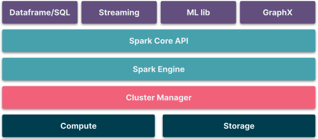

## What is Spark?

Spark is an open-source framework that is used for distributed data processing. In other words, it can be considered a successor to the Hadoop platform. Spark provides a unified interface to process large volumes of data by abstracting the complexity of distributed computing and storage.

Historically, Hadoop solved the problem of variety, volume, and velocity of data by adopting distributed mechanisms for cluster management (YARN), storage mechanism (HDFS), and compute (MapReduce). However, Hadoop-based systems are not optimized for performance and have strong coupling with YARN and Java. Spark was designed to solve some native issues encountered in the Hadoop system.

1. Spark supports in-memory processing, hence optimized for performance.
2. Spark programming supports Java, Scala, Python, and R.
3. Cluster management is available through Kubernetes, Mesos, and YARN orchestrators.
4. Spark supports advanced data workloads such as ML algorithms, graph and stream processing through MLlib, GraphX, and Stream API.
5. Spark eases the development of data applications through a unified API of Dataframe and Spark SQL through the adoption of Resilient Distributed Dataset (RDD).

Following is the high-level logical architecture of Spark.

Following are key aspects of different layers in the architecture:
1. The top layer exposes APIs for addressing different data processing requirements like machine learning, graph, stream and SQL. Using these APIs, we can build continuous and streaming data workloads.
2. The Spark Core is the foundation for the top layer through its Resilient Distributed Dataset (RDD), optimizations (catalyst optimizer), scheduling, and other abstractions.
3. The Spark engine is the heavy lifter that understands the Spark application request, generates DAG, breaks the flow into smaller units, schedules the units, supplies the required data to the units, monitors and provides fault tolerance to the smaller units, and finally orchestrates the results.
4. Cluster manager provides the abstraction of master and worker nodes of the cluster from the Spark application. Typically, this layer would be substituted by YARN, Mesos, and Kubernetes.
5. Compute and storage resources power all the layers with required processing and storage space. This layer is provisioned by cloud infrastructure providers like Azure, AWS, and GCP.