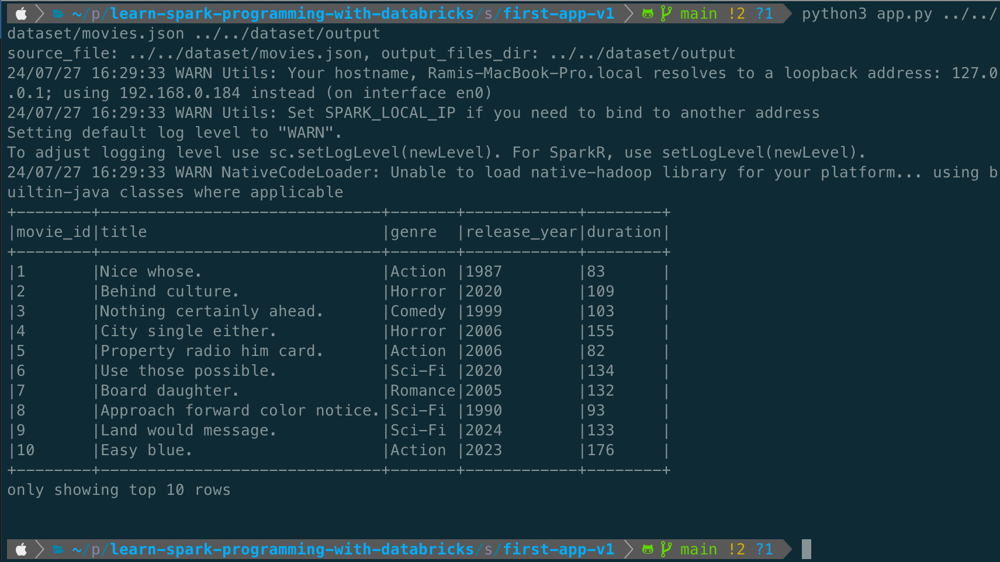
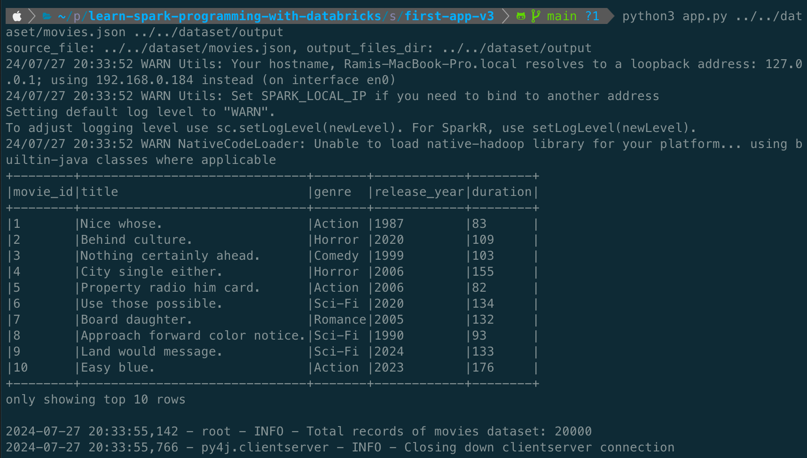
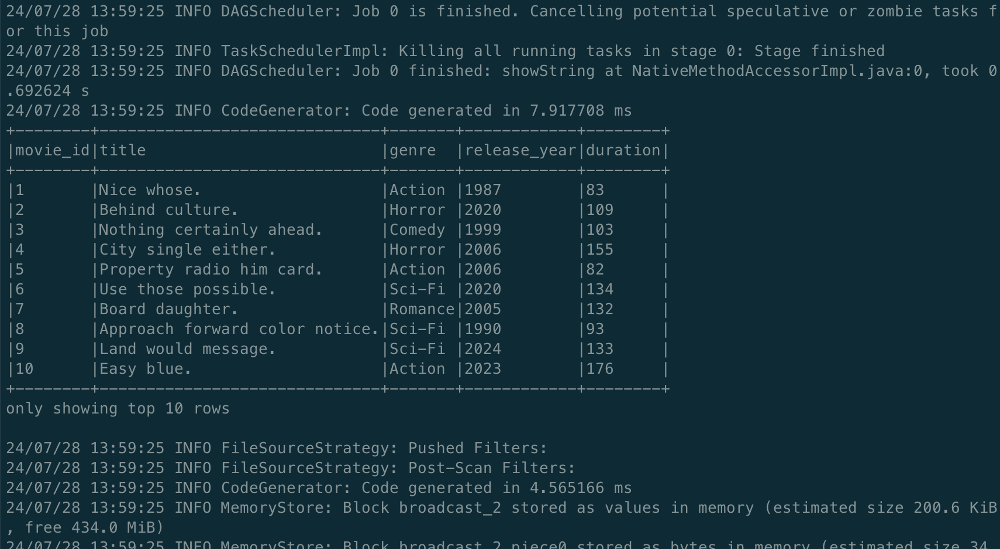
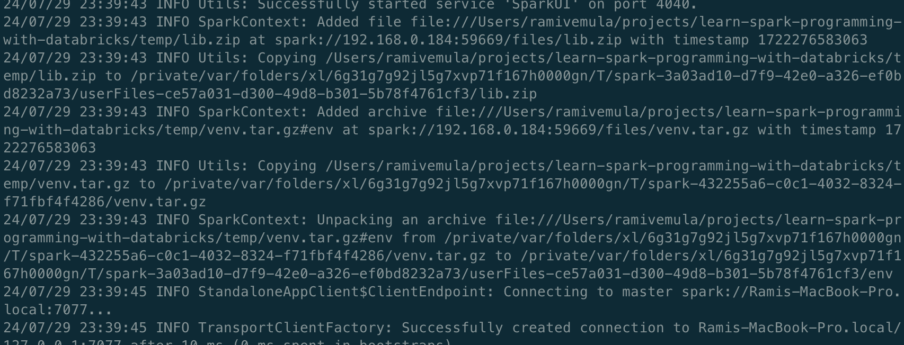
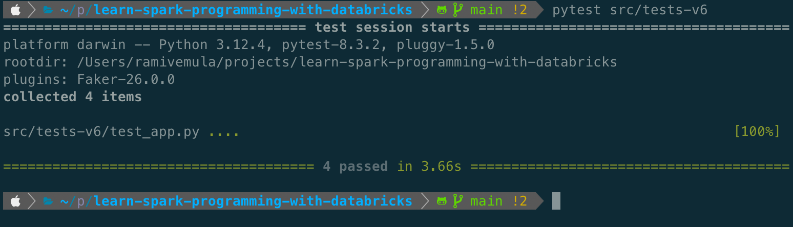
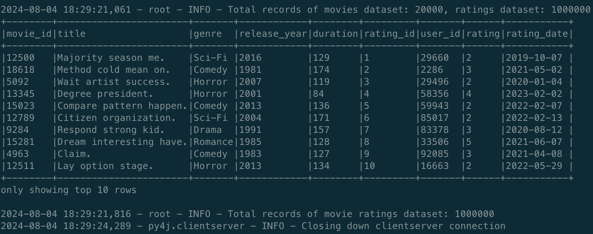

## First Application

Update the [requirements.txt](./../src/requirements.txt) by adding pyspark dependency.

> NOTE: Make sure
> 1. The PySpark package version matches with the Spark version installed on local machine.
> 2. The Virtual env. is activated.

Create [app.py](./../src/first-app-v1/app.py) which reads the `movies.json` file and writes in `parquet` format.

Details of the code:
1. A `SparkSession` has been created which is configured to run on local cores. The session can be configured with remote cluster as well, which we will try out later.
2. It is always good practice to define the schema and read the source data.
3. The final output is written to the directory in the parquet format.

```
cd learn-spark-programming-with-databricks
cd src
pip install -r requirements.txt
cd first-app-v1
python3 app.py ../../dataset/movies.json ../../dataset/output
```




## Handling Spark Configuration

Spark framework allows us to configure application with multiple options to optimize the performance and manage the resources efficiently. Following are few important configuration options.

1. `spark.app.name`
2. `spark.master`
3. `spark.executor.memory`
4. `spark.executor.cores`
5. `spark.yarn.executor.memoryOverhead`
6. `spark.driver.memory`
7. `spark.driver.cores`
8. `spark.yarn.driver.memoryOverhead`
9. `spark.default.parallelism`
10. `spark.sql.shuffle.partitions`
11. `spark.sql.autoBroadcastJoinThreshold`
12. `spark.sql.codegen.wholeStage`
13. `spark.eventLog.enabled`
14. `spark.eventLog.dir`
15. `spark.checkpoint.dir`
16. `spark.checkpoint.compress`

> NOTE: Spark comes with default configuration template which can be typically found at `<SPARK_HOME>/conf/spark-defaults.conf.template`. We can rename it to `spark-default.conf` to make it effective.

Create [app.py](./../src/first-app-v2/app.py) which extends V1 version. All the configuration settings are placed in [spark.conf](./../src/first-app-v2/spark.conf) which is read by [lib/config.py](./../src/first-app-v2/lib/config.py). The `SparkConf` object is the applied to the `SparkSession`.

> NOTE: Make sure the virtual env. is activated.

```
cd learn-spark-programming-with-databricks
cd src
pip install -r requirements.txt
cd first-app-v2
python3 app.py ../../dataset/movies.json ../../dataset/output spark.conf
```

## Creating a custom logger

Let's now create a custom logger to log messages from the spark application. The custom logger class is based on Python's logging package which uses `StreamHandler` to stream logs to the sink. The `CustomLogger` code can be found at [lib/logger.py](./../src/first-app-v3/lib/logger.py) and is then used in [app.py](./../src/first-app-v3/app.py).

> NOTE: Make sure the virtual env. is activated.

```
cd learn-spark-programming-with-databricks
cd src
pip install -r requirements.txt
cd first-app-v3
python3 app.py ../../dataset/movies.json ../../dataset/output spark.conf
```



## Deploy the spark application

To make the `lib` as a package, we need to add [lib/\_\_init\_\_.py](./../src/first-app-v4/lib/__init__.py).

Update the [spark.conf](./../src/first-app-v4/spark.conf) with the master url.
```
spark.master=spark://Ramis-MacBook-Pro.local:7077
```

> NOTE: Make sure the virtual env. is activated.

Execute below commands to run our application standalone cluster.

```
cd learn-spark-programming-with-databricks/src/first-app-v4/
zip -r lib.zip lib/*
cd ../..
mkdir temp
cd temp
mv ../src/first-app-v4/lib.zip .
cp ../src/first-app-v4/app.py .
cp ../src/first-app-v4/spark.conf .
cp ../dataset/movies.json .
```

The above commands creates the `lib` zip package, copies the `lib.zip`, `app.py`, `spark.conf` and `movies.json` to temp directory.

Submit the spark application from temp directory by executing below command. Replace the `--master` url with the master url of your local's standalone cluster.

```
spark-submit --master spark://Ramis-MacBook-Pro.local:7077 --py-files lib.zip app.py movies.json output spark.conf
```


At the end of execution, we can delete the `temp` folder.

```
cd learn-spark-programming-with-databricks
rm -rf temp
```

## Package Spark Application dependencies

Sometimes our Spark app will be having dependencies from different packages (like pyarrow, pandas, matplotlib etc.). These packages will not be available readily in spark env. Let's see how we can package the dependencies of our Spark application. 

Let's create a fake dependency by importing pyarrow in [lib/config.py](./../src/first-app-v5/lib/config.py). Include pyarrow and venv-pack in the [requirements.txt](./../src/requirements.txt).

> NOTE: Make sure the virtual env. is activated.

```
cd learn-spark-programming-with-databricks
cd src
pip install -r requirements.txt
cd ..
venv-pack -o venv.tar.gz

cd src/first-app-v5/
zip -r lib.zip lib/*
cd ../..
mkdir temp
cd temp
mv ../src/first-app-v5/lib.zip .
cp ../src/first-app-v5/app.py .
cp ../src/first-app-v5/spark.conf .
cp ../dataset/movies.json .
mv ../venv.tar.gz .
```

Submit the spark application from temp directory by executing below command. We pass the packages virtual environment through `--archives` attribute. The `#env` tells the spark-submit command where to unzip the virtual env.

We also need to set `PYSPARK_DRIVER_PYTHON` and `PYSPARK_PYTHON` to leverage the python executable from the unzipped virtual env. on the cluster. Replace the `--master` url with the master url of your local's standalone cluster.

```
export PYSPARK_DRIVER_PYTHON=python3
export PYSPARK_PYTHON=./env/bin/python3
spark-submit --master spark://Ramis-MacBook-Pro.local:7077 --archives venv.tar.gz#env --py-files lib.zip app.py movies.json output spark.conf
```



At the end of execution, we can delete the `temp` folder.

```
cd learn-spark-programming-with-databricks
rm -rf temp
```

## Unit testing Spark Application

Update [requirements.txt](../src/requirements.txt) with `pytest` dependency.

The [app.py](../src/first-app-v6/app.py) code is refactored to be modular. This way we can mock different functions which would make the overall code more unit test friendly.

Add [\_\_init\_\_.py](../src/first-app-v6/__init__.py) to `first-app-v6` directory to convert it to a module, so that we can import the entire module in unit tests. Add `first-app-v6` module to `PYTHONPATH` by executing below command (change the path accordingly to you local path).

```
export PYTHONPATH=$PYTHONPATH:/Users/ramivemula/projects/learn-spark-programming-with-databricks/src/first-app-v6
```

Create test cases at [test_app.py](../src/tests-v6/test_app.py). Execute the test cases by following command.

```
cd learn-spark-programming-with-databricks
pytest src/tests-v6/
```



## Basic Spark Transformations

PySpark provides a variety of transformations that can be applied to DataFrames and RDDs. However, RDD based programming is not encouraged by the Spark community because of following major advantages of DataFrame APIs. Spark DataFrame is `immutable` which means any transformation will lead to a new DataFrame instance.

1. Abstractions are user-friendly and expressive
2. Wide range of built-in functions 
3. Catalyst optimizations (Column pruning, predicate pushdown etc.)
4. Ease of usage
5. Interoperability with SQL

Following are basic transformations which are available in Spark. Code can be found out at [app.py](../src/first-app-v7/app.py).

> NOTE: We will discuss aggregate and join based transformations in subsequent sections. This section only covers basic transformations.

| Transformation      | Details                                                           |
|---------------------|-------------------------------------------------------------------|
| select() / alias()  | Projects a set of expressions and returns a new DataFrame.        |
| selectExpr()        | Uses SQL expression to project the data                           | 
| filter() / where()  | Filters rows using a given condition. Filter uses SQL expression. |
| withColumn()        | Adds a new column or replaces an existing column.                 |
| drop()              | Drops a column from the DataFrame.                                |
| withColumnRenamed() | Renames a given column name                                       |
| orderBy() / sort()  | Returns a new DataFrame sorted by the specified columns.          |
| distinct()          | Returns a new DataFrame with distinct rows.                       |

## Joins in Spark Application

Spark supports following jonins.

1. inner: Returns only the rows that have matching values in both DataFrames.
2. outer: Returns all rows from both DataFrames irrespective whether there are matching or not.
3. left_outer: Returns all rows from the left DataFrame and the matched rows from the right DataFrame.
4. right_outer: Returns all rows from the right DataFrame and the matched rows from the left DataFrame.
5. left_semi: Returns only the rows from the left DataFrame for which there is a match in the right DataFrame.
6. left_anti: Returns only the rows from the left DataFrame for which there is no match in the right DataFrame.
7. crossJoin: Returns the Cartesian product of the two DataFrames.

`inner` join implementation of `movies` and `ratings` datasets can be found at [app.py](../src/first-app-v8/app.py).

Following are key aspects of spark joins.

1. Make sure column names are unique between the datasets.
2. Ensure the columns of join condition have same schema.
3. Avoid cartesian product joins, which means make sure the join condition is not broad.

> NOTE: There are performance optimization strategies which can be applied to improve join performance. We will discuss them in subsequent sections.




