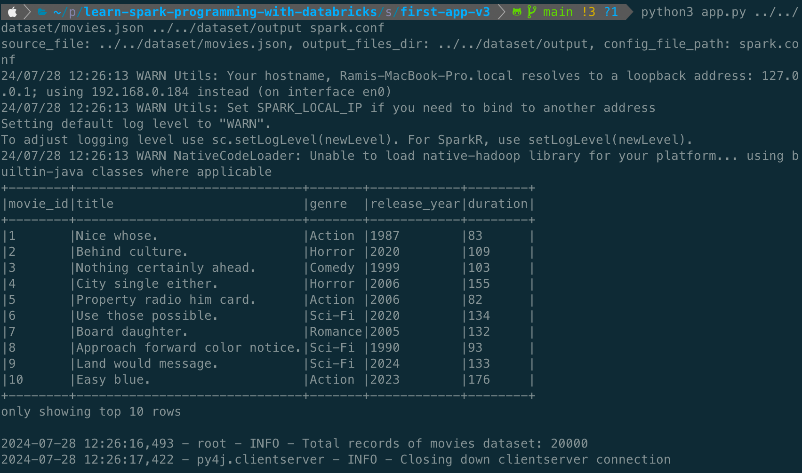

## First Application

Update the [requirements.txt](./../src/requirements.txt) by adding pyspark dependency.

> NOTE: Make sure
> 1. The PySpark package version matches with the Spark version installed on local machine.
> 2. The Virtual env. is activated.

Create [app.py](./../src/first-app-v1/app.py) which reads the `movies.json` file and writes in `parquet` format.

Details of the code:
1. A `SparkSession` has been created which is configured to run on local cores. The session can be configured with remote cluster as well, which we will try out later.
2. It is always good practice to define the schema and read the source data.
3. The final output is written to the directory in the parquet format.

```
cd learn-spark-programming-with-databricks
cd src
pip install -r requirements.txt
cd first-app-v1
python3 app.py ../../dataset/movies.json ../../dataset/output
```


## Handling Spark Configuration

Spark framework allows us to configure application with multiple options to optimize the performance and manage the resources efficiently. Following are few important configuration options.

1. `spark.app.name`
2. `spark.master`
3. `spark.executor.memory`
4. `spark.executor.cores`
5. `spark.yarn.executor.memoryOverhead`
6. `spark.driver.memory`
7. `spark.driver.cores`
8. `spark.yarn.driver.memoryOverhead`
9. `spark.default.parallelism`
10. `spark.sql.shuffle.partitions`
11. `spark.sql.autoBroadcastJoinThreshold`
12. `spark.sql.codegen.wholeStage`
13. `spark.eventLog.enabled`
14. `spark.eventLog.dir`
15. `spark.checkpoint.dir`
16. `spark.checkpoint.compress`

> NOTE: Spark comes with default configuration template which can be typically found at `<SPARK_HOME>/conf/spark-defaults.conf.template`. We can rename it to `spark-default.conf` to make it effective.

Create [app.py](./../src/first-app-v2/app.py) which extends V1 version. All the configuration settings are placed in [spark.conf](./../src/first-app-v2/spark.conf) which is read by [lib/config.py](./../src/first-app-v2/lib/config.py). The `SparkConf` object is the applied to the `SparkSession`.

```
cd learn-spark-programming-with-databricks
cd src
pip install -r requirements.txt
cd first-app-v2
python3 app.py ../../dataset/movies.json ../../dataset/output spark.conf
```

## Creating a custom logger

Let's now create a custom logger to log messages from the spark application. The custom logger class is based on Python's logging package which uses `StreamHandler` to stream logs to the sink. The `CustomLogger` code can be found at [lib/logger.py](./../src/first-app-v3/lib/logger.py) and is then used in [app.py](./../src/first-app-v3/app.py).

```
cd learn-spark-programming-with-databricks
cd src
pip install -r requirements.txt
cd first-app-v3
python3 app.py ../../dataset/movies.json ../../dataset/output spark.conf
```



## Deploy the spark application

To make the `lib` as a package, we need to add [lib/\_\_init\_\_.py](./../src/first-app-v4/lib/__init__.py).

Update the [spark.conf](./../src/first-app-v4/spark.conf) with the master url.
```
spark.master=spark://Ramis-MacBook-Pro.local:7077
```

Execute below commands to run our application standalone cluster.
```
cd learn-spark-programming-with-databricks/src/first-app-v4/
zip -r lib.zip lib/*
cd ../..
mkdir temp
cd temp
mv ../src/first-app-v4/lib.zip
cp ../src/first-app-v4/app.py .
cp ../src/first-app-v4/spark.conf .
cp ../dataset/movies.json .
```

The above commands creates the `lib` zip package, copies the `lib.zip`, `app.py`, `spark.conf` and `movies.json` to temp directory.

Submit the spark application from temp directory by executing below command. Replace the `--master` url with the master url of your local's standalone cluster.

```
spark-submit --master spark://Ramis-MacBook-Pro.local:7077 --py-files lib.zip app.py movies.json output spark.conf
```


At the end of execution, we can delete the `temp` folder.

```
cd learn-spark-programming-with-databricks
rm -rf temp
```

