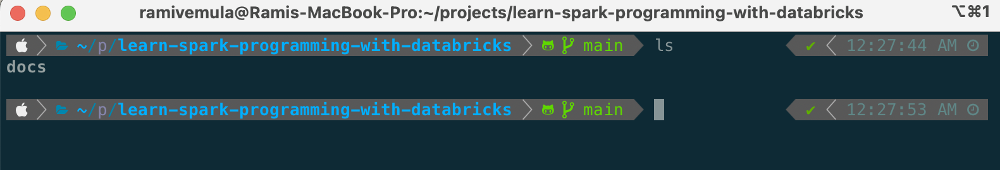

## Tools Setup

This section lists out all the tools and framework dependencies required to develop, debug and deploy our project.
| Tool | Installation Steps | Version |
|--|--|--|
| Git | `brew install git` | 2.45.2 |

## Terminal Setup

This section describes my terminal setup details. Except `brew` package manager, this terminal setup is completely optional. 

I am only sharing my terminal setup details because I find this setup is cool and especially the split window capability of `iTerm2` improves my productivity. 

 

> NOTE: If any of the below tools are already installed using brew, use `brew upgrade` to update the formula of specific package.

 

| Tool | Installation Steps | Version |
|--|--|--|
| Brew | `/bin/bash -c "$(curl -fsSL https://raw.githubusercontent.com/Homebrew/install/HEAD/install.sh)"` | 4.3.10 |
| iTerm2 | `brew install --cask iterm2` | 3.5.3 |
| On-My-Zsh | `sh -c "$(curl -fsSL https://raw.githubusercontent.com/ohmyzsh/ohmyzsh/master/tools/install.sh)"`    Edit `~/.zshrc` and set `ZSH_THEME` to `agnoster`| 5.9 |
| PowerLevel10k | `brew install romkatv/powerlevel10k/powerlevel10k`     Now to add `powerlevel10k` zsh theme to `.zshrc`, check the path `/opt/homebrew/Cellar/powerlevel10k/1.20.0/share/powerlevel10k/powerlevel10k.zsh-theme` in your machine. If the path do not exists, find the path to `powerlevel10k.zsh-theme`     Execute `echo "/opt/homebrew/Cellar/powerlevel10k/1.20.0/share/powerlevel10k/powerlevel10k.zsh-theme" >>~/.zshrc`     Run `p10k configure` to discover all options | 1.20.0 |
| MesloLGS NF | Skip this step if `p10k configure`  is used to configure the font.    Download and install from `https://github.com/romkatv/dotfiles-public/tree/master/.local/share/fonts/NerdFonts` | N/A |

 

> Configure iTerm2 with theme and fonts:    - `Profiles > Select Default Profile > Edit Default Profile > Colors > Color Presets… > Solarized Dark`      - `Profiles > Select Default Profile > Edit Default Profile > Text > Font > MesloLGS NF`     We can turn off the mark indicators in iTerm2   - `Profiles > Select Default Profile > Edit Default Profile > Terminal > scroll down to "Shell Integration" > turn off "Show mark indicators"`.

 

At the end of above exercise, iTerm2 terminal should look like as below.

 
