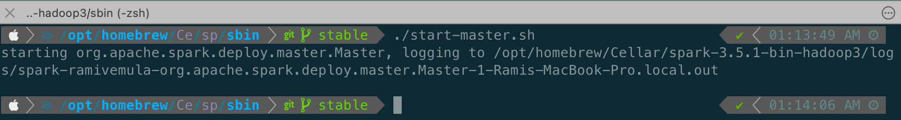
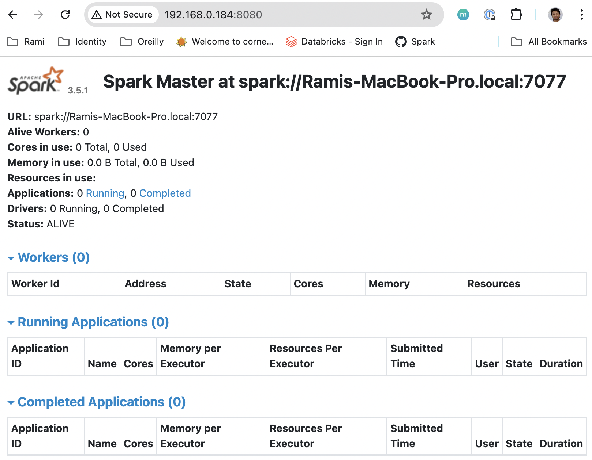
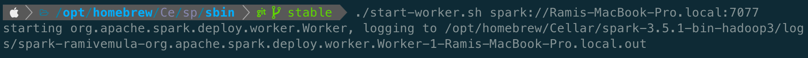
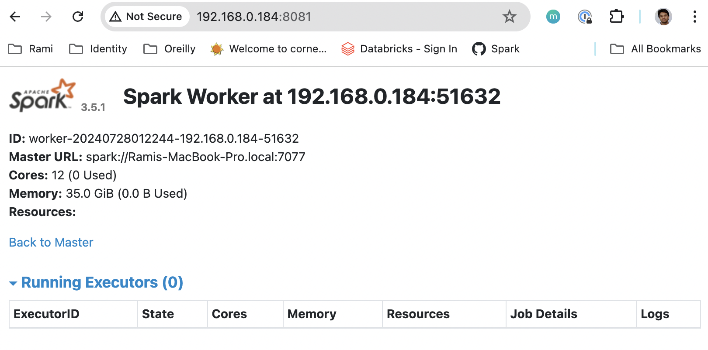

## Development Tools Setup

We will install Git and Visual Studio Code for our development activities. There are other alternatives as well (for example, instead of using Visual Studio Code, we can opt for any other IDE like PyCharm as well), feel free to use any of the available alternatives. Below installation steps are for macOS.

| Tool                                                                   | Installation Steps                                                                                                                                                                                          | Version    |
|------------------------------------------------------------------------|-------------------------------------------------------------------------------------------------------------------------------------------------------------------------------------------------------------|------------|
| Git                                                                    | `brew install git`                                                                                                                                                                                          | 2.45.2     |
| Visual Studio Code                                                     | `brew install visual-studio-code`                                                                                                                                                                           | 1.91.1     |
| Python extension                                                       | Install from VS Code extensions                                                                                                                                                                             | v2024.10.0 |
| Jupyter extension                                                      | Install from VS Code extensions                                                                                                                                                                             | v2024.6.0  |
| Configure Python Language Server <br/> to Jedi for better Intellisense | VS Code <br/> &#8594; Command Palette (`cmd + shift + p`) <br/> &#8594; Preferences: Open User Settings (JSON) <br/> &#8594; Enter `"python.languageServer": "Jedi"` <br/> &#8594; Save and restart VS Code | N/A        |
| vscode-icons (optional)                                                | Install form VS code extensions                                                                                                                                                                             | v12.8.0    |

## Spark Setup

We need to install Java Python and Spark to develop Spark application in local environment.

> NOTE: The paths specified in the below commands will vary based on the installation location. Hence, please verify the paths where Brew installs the software.

| Task   | Installation Steps                                                                                                                                                                                                                                                                                                                                                                                                                                                                                                                   | Version                    |
|--------|--------------------------------------------------------------------------------------------------------------------------------------------------------------------------------------------------------------------------------------------------------------------------------------------------------------------------------------------------------------------------------------------------------------------------------------------------------------------------------------------------------------------------------------|----------------------------|
| Java   | `brew install java11` <br/><br/> Add the symlink `sudo ln -sfn /opt/homebrew/opt/openjdk@11/libexec/openjdk.jdk /Library/Java/JavaVirtualMachines/openjdk-11.jdk` <br/><br/> Set PATH  `echo 'export PATH="/opt/homebrew/Cellar/openjdk@11/11.0.24/bin:$PATH"' >> ~/.zshrc` <br/> <br/> Set JAVA_HOME  `echo 'export JAVA_HOME="/opt/homebrew/Cellar/openjdk@11/11.0.24"' >> ~/.zshrc` <br/> <br/> Execute `java --version` to ensure installation is successful                                                                     | openjdk 11.0.24 2024-07-16 |
| Python | `brew install python` <br> <br/> Set PATH `echo 'export PATH="/opt/homebrew/Cellar/python@3.12/3.12.4/bin:$PATH"' >> ~/.zshrc` <br/> <br/> Set PYSPARK_PYTHON `echo 'export PYSPARK_PYTHON=python3' >> ~/.zshrc` <br/> <br/> Execute `python3 --version` to ensure installation is successful                                                                                                                                                                                                                                        | 3.12.4                     |
| Spark  | Download Spark (currently spark-3.5.1-bin-hadoop3.tgz) from [website](https://spark.apache.org/downloads.html) <br/> <br/> Unzip and copy the contents to `/opt/homebrew/Cellar/spark-3.5.1-bin-hadoop3` <br/><br/> Set PATH  `echo 'export PATH="/opt/homebrew/Cellar/spark-3.5.1-bin-hadoop3/bin:$PATH"' >> ~/.zshrc` <br/> <br/> Set SPARK_HOME  `echo 'export SPARK_HOME="/opt/homebrew/Cellar/spark-3.5.1-bin-hadoop3"' >> ~/.zshrc` <br/> <br/> Execute `pyspark` to see spark interactive shell and there should be no errors | 3.5.1                      |

> NOTE: On Windows systems, apart from above installed frameworks, we also need to install [Hadoop winutils](https://github.com/cdarlint/winutils) and set `HADOOP_HOME` and `PATH` variables accordingly. 

## Setup Python Virtual env.

A Python virtual environment is a tool that helps to segregate the dependencies of different projects by creating isolated Python virtual environments for them.

> NOTE: Clone this repository (https://github.com/DreamingDevs/learn-spark-programming-with-databricks) to your local machine.

Open terminal and navigate into the root directory (learn-spark-programming-with-databricks) of the repository.

```
cd learn-spark-programming-with-databricks
python3 -m venv .venv
source .venv/bin/activate
```

At this point, we can start working on our code and test it in VS Code.

At the end of development, we can deactivate the virtual env., by executing below command.
```
deactivate
```

## Azure and Databricks Setup

We primarily consider two options to work with Databricks.
1. Azure Subscription-based Databricks service
2. Databricks Community Edition (independent of cloud provider)

In this repository, we proceed with option # 1, as the other option got limited to only certain features.

To begin with, we need to create an Azure Subscription ([Get Started for free](https://azure.microsoft.com/en-in/free)). The free subscription provides USD 200 credit to use with in 30 days, which we can work with 55 Azure services. Once the 30-day window is lapsed, the account gets converted to a pay-as-you-go subscription, which will enable us to pay only if we use more than the initial provided credits.

To get access to all the features of Databricks, we need to create a Databricks Premium service, which is only available in an Azure Pay-as-you-go subscription. So I highly recommend converting the free subscription to a pay-as-you-go model by using the `upgrade` option, which is available under the Subscription section of the Azure portal.

## Start a Spark Cluster

Let's start a standalone Spark cluster in our local environment. We installed Spark at `/opt/homebrew/Cellar/spark-3.5.1-bin-hadoop3`. The scripts to start and stop the master and worker nodes are available under `sbin` folder of the spark-3.5.1-bin-hadoop3 directory.

```
cd /opt/homebrew/Cellar/spark-3.5.1-bin-hadoop3
cd sbin
./start-master.sh
```

> NOTE: We can also configure both master and worker for cores, memory, ports, host etc. However, for simplicity, we are going to configure both master and worker with defaults.



Navigate to the `logs` folder as shown in the above image to find the WebUI URL for the master node. In my case, it is `http://192.168.0.184:8080/`



Copy the URL that is displayed on the UI:`spark://Ramis-MacBook-Pro.local:7077`

```
cd /opt/homebrew/Cellar/spark-3.5.1-bin-hadoop3
cd sbin
./start-worker.sh spark://Ramis-MacBook-Pro.local:7077
```



Navigate to the `logs` folder as shown in the above image to find the WebUI URL for the worker node. In my case, it is `http://192.168.0.184:8081/`



Once our work is completed, we can stop both master and worker.

```
cd /opt/homebrew/Cellar/spark-3.5.1-bin-hadoop3
cd sbin
./stop-master.sh
./stop-worker.sh
```

## Terminal Setup

This section describes my terminal setup details. Except `brew` package manager, this terminal setup is completely optional. 

I am only sharing my terminal setup details because I find this setup is cool and especially the split window capability of `iTerm2` improves my productivity.

> NOTE: If any of the below tools are already installed using brew, use `brew upgrade` to update the formula of specific package.

| Tool          | Installation Steps                                                                                                                                                                                                                                                                                                                                                                                                                                                                                          | Version |
|---------------|-------------------------------------------------------------------------------------------------------------------------------------------------------------------------------------------------------------------------------------------------------------------------------------------------------------------------------------------------------------------------------------------------------------------------------------------------------------------------------------------------------------|---------|
| Brew          | `/bin/bash -c "$(curl -fsSL https://raw.githubusercontent.com/Homebrew/install/HEAD/install.sh)"`                                                                                                                                                                                                                                                                                                                                                                                                           | 4.3.10  |
| iTerm2        | `brew install --cask iterm2`                                                                                                                                                                                                                                                                                                                                                                                                                                                                                | 3.5.3   |
| On-My-Zsh     | `sh -c "$(curl -fsSL https://raw.githubusercontent.com/ohmyzsh/ohmyzsh/master/tools/install.sh)"` <br /><br /> Edit `~/.zshrc` and set `ZSH_THEME` to `agnoster`                                                                                                                                                                                                                                                                                                                                            | 5.9     |
| PowerLevel10k | `brew install romkatv/powerlevel10k/powerlevel10k` <br /> <br /> Now to add `powerlevel10k` zsh theme to `.zshrc`, check the path `/opt/homebrew/Cellar/powerlevel10k/1.20.0/share/powerlevel10k/powerlevel10k.zsh-theme` in your machine. If the path do not exists, find the path to `powerlevel10k.zsh-theme` <br /> <br /> Execute `echo "/opt/homebrew/Cellar/powerlevel10k/1.20.0/share/powerlevel10k/powerlevel10k.zsh-theme" >>~/.zshrc` <br /> <br /> Run `p10k configure` to discover all options | 1.20.0  |
| MesloLGS NF   | Skip this step if `p10k configure`  is used to configure the font. <br /><br /> Download and install from `https://github.com/romkatv/dotfiles-public/tree/master/.local/share/fonts/NerdFonts`                                                                                                                                                                                                                                                                                                             | N/A     |

> Configure iTerm2 with theme and fonts:  <br/> - `Profiles > Select Default Profile > Edit Default Profile > Colors > Color Presets… > Solarized Dark` <br /> <br />  - `Profiles > Select Default Profile > Edit Default Profile > Text > Font > MesloLGS NF` <br /> <br /> We can turn off the mark indicators in iTerm2 <br /> - `Profiles > Select Default Profile > Edit Default Profile > Terminal > scroll down to "Shell Integration" > turn off "Show mark indicators"`.

At the end of above exercise, iTerm2 terminal should look like as below.


